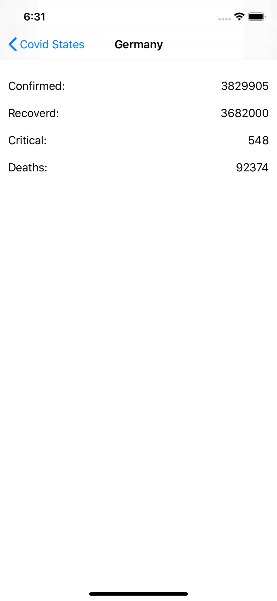
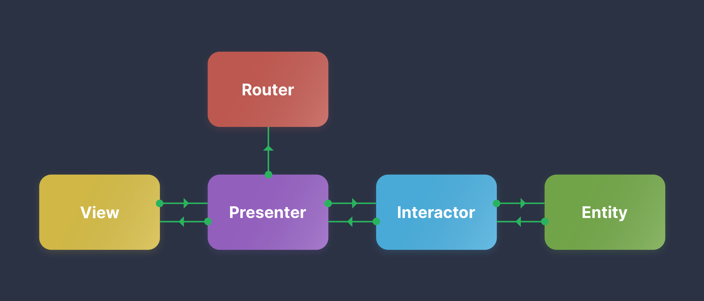

# Covid-app

Covid is an sample iOS App written in Swift using the VIPER architecture.


[](https://swift.org)

## Sample App



### Architecture


### Run Sample 
1. Clone this repository.
    ```
    git clone git@github.com:eslamwael74/covid-app.git
    ```

2. Open `covid.xcodeproj` in Xcode. 

3. Run


## Requirements

- Xcode 10.0+
- Swift 4.2+
